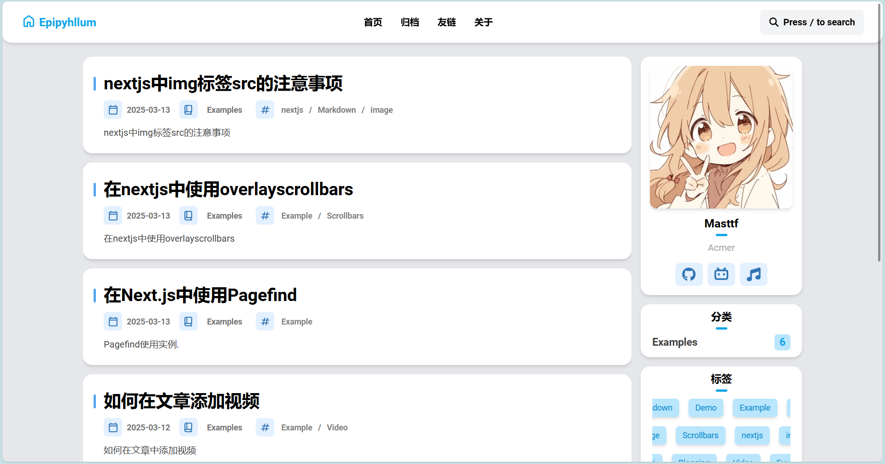
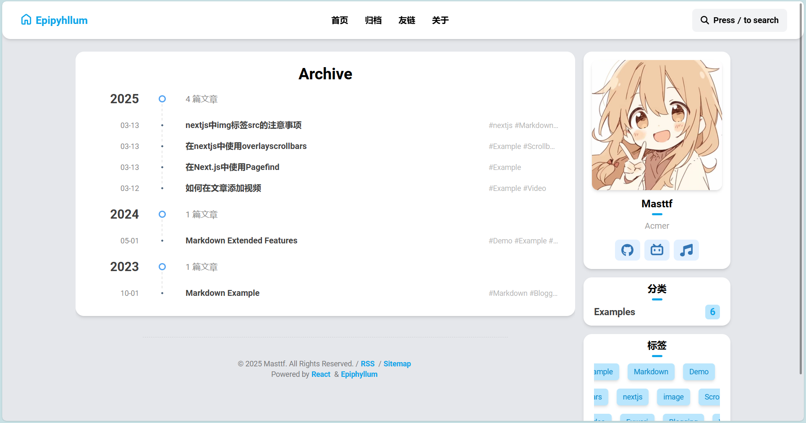
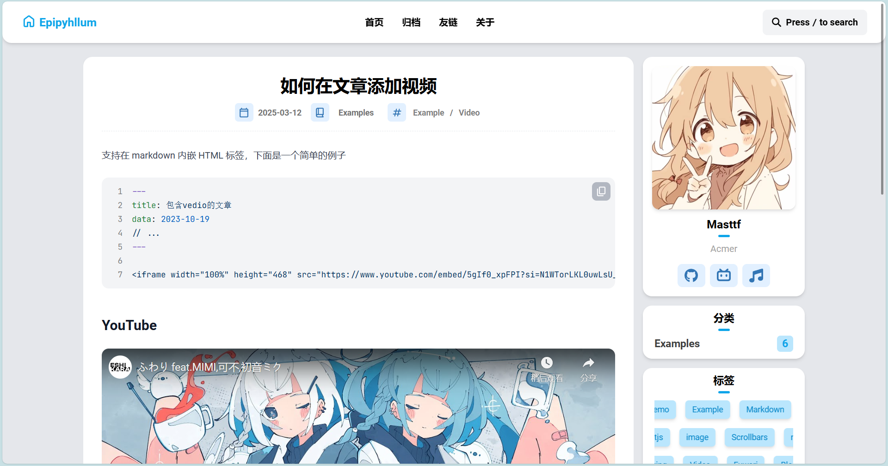

This is a [Next.js](https://nextjs.org) project bootstrapped with [`create-next-app`](https://nextjs.org/docs/app/api-reference/cli/create-next-app).







## Getting Started

进入到项目只需要

```
pnpm install
pnpm build
pnpm start
```

个人信息等信息修改可在`/src/config/config.ts`

## TODO

- [x] 搜索
- [ ] 目录
- [ ] Light/dark 模式
- [ ] 评论

