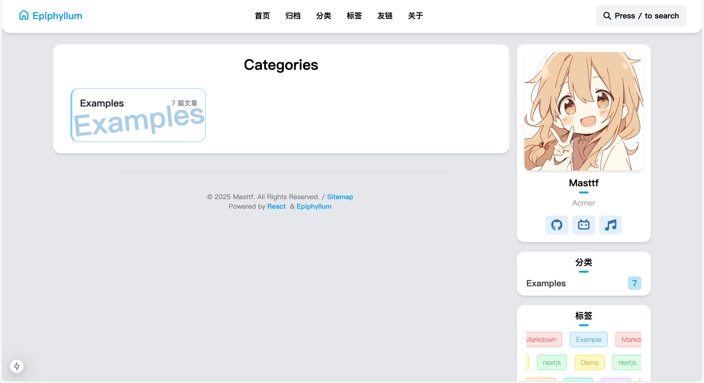

# Epiphyllum

[](http://www.apache.org/licenses/LICENSE-2.0.html)
[](https://github.com/Masttf/Epiphyllum/commits/master)
[](https://github.com/Masttf/Epiphyllum/issues)
[](https://github.com/Masttf/Epiphyllum/pulls)
[](https://github.com/Masttf/Epiphyllum)
[](https://github.com/Masttf)
[](https://github.com/Masttf/Epiphyllum)

## 页面展示




## Features

- 使用next.js SSG静态渲染 灯塔接近满分

​	

- 使用Pagefind 静态搜索
- 404界面

## GET Satrt

具体配置文件在 `/src/config/config.ts`

```ts
export const WebName: string = "Epiphyllum"; //网站名字显示在导航栏左上角
export const WebUrl: string = "https://epiphyllum.masttf.fun"; // 网站地址

//favicon 网站图标
// 使用 https://realfavicongenerator.net 选择html生成图片替换/public/favion 文件夹

export interface ProfileConfig {
    name: string;
    bio: string;
    imageSrc: string;
}
export const profileConfig: ProfileConfig = { //个人信息
    name: "Masttf",
    bio: "xxxx",
    imageSrc: "/avatar.jpg",
    //如果放在public文件夹下，则直接/即可
    //如果图片是链接请在next.config.js中配置images:{domains: ["masttf.fun"],}
};

export interface friend {
    name: string;
    url: string;
    avatar: string;
    bio: string;
}
export const friends: friend[] = [ //友链
    {
        name: "Masttf",
        url: "https://epiphyllum.masttf.fun/",
        avatar: "https://masttf.fun/static/img/1f3cc55c3d0693d0583f4e7fff5c7aab.b_6dbd850baa93eeacc9c174faafb1e29b.webp",
        bio: "Masttf",
    },
];

export interface link {
    name: string;
    url: string;
    symbolId: string;
}
export const links: link[] = [ //侧边栏个人信息下面显示的联系调整，symbolId 是Icon的id 具体参考组件下的Icon.tsx
    {
        name: "github",
        url: "https://github.com/Masttf",
        symbolId: "ai:fa6-brands:github",
    },
];

export interface linkItem {
    name: string;
    url: string;
}
export const linkList: linkItem[] = [ //导航栏连接
    { name: "首页", url: "/" },
    { name: "归档", url: "/archive" },
    { name: "分类", url: "/categories" },
    { name: "标签", url: "/tags" },
    { name: "友链", url: "/friends" },
    { name: "关于", url: "/about" },
];

```


## TODO

-   [x] 搜索
-   [x] 目录
-   [ ] Light/dark 模式
-   [ ] 评论
-   [ ] 管理后台

## 项目结构

```
.
├── .gitignore                  # Git忽略规则
├── .npmrc                      # NPM配置
├── LICENSE                     # 开源许可证
├── README.md                   # 项目说明文档
├── eslint.config.mjs           # ESLint配置
├── next.config.ts              # Next.js配置
├── package.json                # 项目依赖配置
├── pnpm-lock.yaml              # PNPM锁文件
├── postcss.config.mjs          # PostCSS配置
├── tailwind.config.ts          # Tailwind CSS配置
├── tsconfig.json               # TypeScript配置
├── assets/                     # 静态资源
├── public/                     # 公共资源目录
│   ├── avatar.jpg              # 头像图片
│   ├── test.jpg                # 测试图片
│   ├── favicon/                # 网站图标
│   └── posts/                  # 文章相关资源
│       └── assets/
├── script/                     # 脚本目录
│   └── update.sh               # 更新脚本
└── src/                        # 源代码目录
    ├── app/                    # Next.js App Router
    │   ├── layout.tsx          # 全局布局
    │   ├── not-found.tsx       # 404页面
    │   ├── robots.ts           # 爬虫规则
    │   ├── sitemap.ts          # 网站地图
    │   ├── (main)/             # 主路由
    │   └── (post)/             # 文章路由
    ├── components/             # 公共组件
    ├── config/                 # 配置文件
    │   ├── config.ts           # 应用配置
    │   └── markdownConfig.ts   # Markdown配置
    ├── data/                   # 数据文件
    │   ├── about/              # 关于页面
    │   │   └── about.md        # 关于内容
    │   └── posts/              # 文章内容
    │       └── assets/         # 文章资源
    ├── plugins/                # 插件目录
    ├── styles/                 # 样式文件
    └── utils/                  # 工具函数
        ├── cn.ts               # ClassName工具
        ├── getData.ts          # 数据获取
        └── pages.ts            # 页面元数据获取
```
